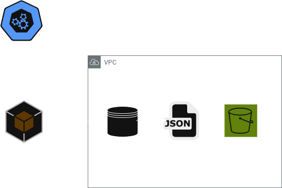

<p align="center">
  
  
## ☁️ 30 Days DevOps Challenge - Weather Dashboard ☁️

This is part of the first project in the 30-day DevOps challenge!
In this project, we will create a weather data collection system using AWS S3 and OpenWeather API. This will grab the data from OpenWeather API to ouput it to the S3 bucket and display weather information. You can enhance this further by implementing data visualization of weather data or creating weather forecasting.  🌟


<h2>Environments and Technologies Used</h2>

  - AWS S3
  - Python
  - AWS SDK for Python (Boto3)
  - OpenWeather API
  - Gitpod (for repo management)


  
<h2>Real World applications</h2>  

- 🌍 Fetch live weather details for various cities
- 🌡️ Display temperature (°F), 💧 humidity, and 🌈 conditions
- 🗂️ Auto-save weather data in AWS S3 for safekeeping
- 🏙️ Track multiple cities simultaneously
- ⏰ Timestamp data for easy historical analysis


<h2>Step by Step Instructions</h2>

***1. Repo and Dependencies configuration***

We will begin by setting up the environment and code that we will be utilizing. In this instance, we will use gitpod to create a new workspace and do the commands from there.

   

We will then give dependencies into the `requirements.txt` file.

```
echo "boto3==1.26.137" >> requirements.txt
echo "python.dotenv==1.0.0" >> requirements.txt
echo "requests==2.28.2" >> requirements.txt
```
After that, we start installing the dependencies:

```
pip install -r requirements.txt
```

***2. AWS CLI Setup***

NOTE: Keep in mind this is for a Linux environment, check the AWS documentation to install it in your supported Os.

   ```
   curl "https://awscli.amazonaws.com/awscli-exe-linux-x86_64.zip" -o "awscliv2.zip"
unzip awscliv2.zip
sudo ./aws/install
```
We then do `AWS configure` and enter our access and secret key along with the region. Output format set to JSON. With this command we will double check that our credentials are put in place for CLI:

```
aws sts get-caller-identity
```

***Set .env variables***

We will now create the .env variables with the Api key generated from Open Weather along with the name of the bucket. Make sure these are set so that code can run correctly.


```

echo "OPENWEATHER_API_KEY=yourapikey" >> .env
echo "AWS_BUCKET_NAME=weather-dashboard-${RANDOM}" >> .env

```

***4. Setting up our python code***

We will then set up the variables for our API. We will import our dependencies first:

```
import os
import json
import boto3
import requests
from datetime import datetime
from dotenv import load_dotenv
```

Then, we will create our environment variables:

```
# Load environment variables
load_dotenv()

class WeatherDashboard:
    def __init__(self):
        self.api_key = os.getenv('OPENWEATHER_API_KEY')
        self.bucket_name = os.getenv('AWS_BUCKET_NAME')
        self.s3_client = boto3.client('s3')
```
NOTE: `OPENWEATHER_API_KEY` needs to be setup beforehand so that the API will fetch the data

With this part we are defining the api key and bucket name of our created bucket in S3 along with interaction with boto3 (the AWS SDK for python).

Next, defining creation if bucket if one has not been created yet (along with error handling) and fetching weather data from OpenWeather API:

```
def create_bucket_if_not_exists(self):
        """Create S3 bucket if it doesn't exist"""
        try:
            self.s3_client.head_bucket(Bucket=self.bucket_name)
            print(f"Bucket {self.bucket_name} exists")
        except:
            print(f"Creating bucket {self.bucket_name}")
        try:
            # Simpler creation for us-east-1
            self.s3_client.create_bucket(Bucket=self.bucket_name)
            print(f"Successfully created bucket {self.bucket_name}")
        except Exception as e:
            print(f"Error creating bucket: {e}")

    def fetch_weather(self, city):
        """Fetch weather data from OpenWeather API"""
        base_url = "http://api.openweathermap.org/data/2.5/weather"
        params = {
            "q": city,
            "appid": self.api_key,
            "units": "imperial"
        }
        
        try:
            response = requests.get(base_url, params=params)
            response.raise_for_status()
            return response.json()
        except requests.exceptions.RequestException as e:
            print(f"Error fetching weather data: {e}")
            return None
```

Lastly, we will define the variables for the weather and cities data of the API as well as making sure data gets saved to the S3 bucket:

```
def save_to_s3(self, weather_data, city):
        """Save weather data to S3 bucket"""
        if not weather_data:
            return False
            
        timestamp = datetime.now().strftime('%Y%m%d-%H%M%S')
        file_name = f"weather-data/{city}-{timestamp}.json"
        
        try:
            weather_data['timestamp'] = timestamp
            self.s3_client.put_object(
                Bucket=self.bucket_name,
                Key=file_name,
                Body=json.dumps(weather_data),
                ContentType='application/json'
            )
            print(f"Successfully saved data for {city} to S3")
            return True
        except Exception as e:
            print(f"Error saving to S3: {e}")
            return False

def main():
    dashboard = WeatherDashboard()
    
    # Create bucket if needed
    dashboard.create_bucket_if_not_exists()
    
    cities = ["Orlando", "Nashville", "Chicago"]
    
    for city in cities:
        print(f"\nFetching weather for {city}...")
        weather_data = dashboard.fetch_weather(city)
        if weather_data:
            temp = weather_data['main']['temp']
            feels_like = weather_data['main']['feels_like']
            humidity = weather_data['main']['humidity']
            description = weather_data['weather'][0]['description']
            
            print(f"Temperature: {temp}°F")
            print(f"Feels like: {feels_like}°F")
            print(f"Humidity: {humidity}%")
            print(f"Conditions: {description}")
            
            # Save to S3
            success = dashboard.save_to_s3(weather_data, city)
            if success:
                print(f"Weather data for {city} saved to S3!")
        else:
            print(f"Failed to fetch weather data for {city}")

if __name__ == "__main__":
    main()
```

***4. Final Result***
For this final step, we will execute the python code, and it should have the bucket along the .json files created. 

`python src/weather_dashboard.py`

And voila! Bucket will be created along with the data of the cities in JSON format!

 


<h2>How to Build/Clone</h2>

```
git clone https://github.com/nilsojc/weatherdash.git

3. Install dependencies:
bashCopypip install -r requirements.txt

4. Configure environment variables (.env):
CopyOPENWEATHER_API_KEY=your_api_key
AWS_BUCKET_NAME=your_bucket_name

4.Configure AWS credentials:
bashCopyaws configure

5. Run the application:
python src/weather_dashboard.py
```
 ---

<h2>Conclusion</h2>

Through this project, I gained hands-on experience with creating and managing AWS S3 buckets, securely handling API keys using environment variables, and applying Python best practices for integrating APIs. I also improved my understanding of Git workflows for efficient project development, learned robust error-handling techniques for distributed systems, and enhanced my skills in managing cloud resources effectively.
